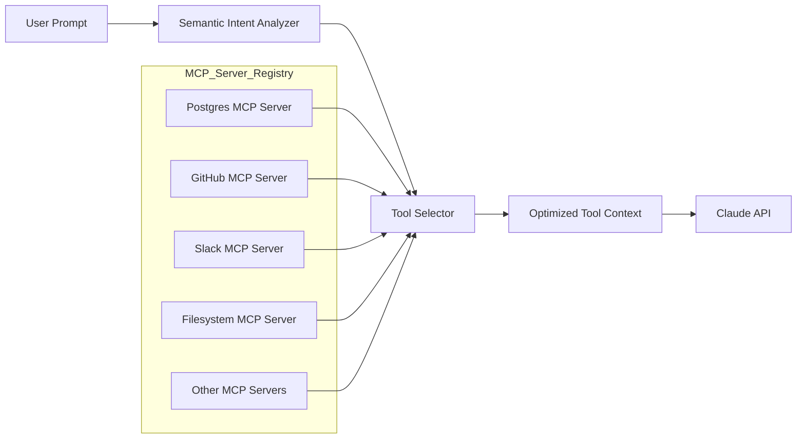

# mcp-dynamic-router

Smart middleware that eliminates context window bloat when connecting multiple MCP servers to Claude.


---

## The Problem

Anthropic's Model Context Protocol (MCP) allows AI agents to connect to multiple tool servers — databases, GitHub, Slack, file systems, and APIs — all at once.

However, there is a major limitation: **every tool definition from every connected server is loaded into the LLM's context window upfront**, even tools that will never be used in a given session.

With 10+ MCP servers connected, this can consume **50,000–100,000+ tokens** on tool definitions alone before the user types a single word.

This leads to:

- Dramatically increased API costs
- Reduced reasoning performance due to context bloat
- Poor scalability for enterprise deployments

---

## The Solution

`mcp-dynamic-router` introduces an intelligent middleware layer between your MCP servers and Claude.

It **defers loading rarely used tool schemas** and dynamically injects only the relevant tool definitions into the model context based on the **semantic intent of the user's prompt**.

---

## Architecture



---

## Key Features

### Semantic Tool Routing
Matches the user’s intent to the most relevant subset of tools before sending context to the model.

### Deferred Schema Loading
Rarely used tools remain outside the context window until they are required.

### Multi-Server Support
Works across any number of registered MCP servers.

### Drop-In Middleware
Wraps existing MCP setups with minimal configuration changes.

### Token Usage Telemetry
Logs how many tokens are saved per session.

### Framework Agnostic
Compatible with any Node.js MCP client.

---

## Installation

```bash
npm install mcp-dynamic-router
```

---

## Quick Start

```typescript
import { DynamicRouter } from "mcp-dynamic-router";

const router = new DynamicRouter({
  maxActiveTools: 10,
  enableSemanticRouting: true
});

router.registerServer({
  name: "postgres-db",
  url: "mcp://localhost:5001"
});

router.registerServer({
  name: "github-tools",
  url: "mcp://localhost:5002"
});

router.registerServer({
  name: "slack-api",
  url: "mcp://localhost:5003"
});

// Returns only the tools relevant to the user's prompt
const optimizedTools = await router.resolve(
  "Create a GitHub issue from my last Slack message"
);

// Pass optimizedTools directly to your Claude API call
```

---

## Benchmarks (Target for v0.1.0)

| Setup | Tool Tokens Used | Estimated Cost per 1M Requests |
|------|------------------|-------------------------------|
| Raw MCP (10 servers) | ~80,000 tokens | ~$240 |
| mcp-dynamic-router | ~12,000 tokens | ~$36 |
| Savings | ~85% | ~85% |

---

## Roadmap

- [ ] Core semantic intent analyzer  
- [ ] Tool deduplication across servers  
- [ ] Support for Anthropic native tool search parameters  
- [ ] Token usage telemetry dashboard  
- [ ] Plugin system for custom routing strategies  
- [ ] Stable NPM release v1.0.0  

---

## Contributing

This project is in early development and contributions are welcome.

1. Fork the repository  
2. Create a feature branch

```bash
git checkout -b feature/my-feature
```

3. Commit your changes

```bash
git commit -m "Add my feature"
```

4. Push to your branch

```bash
git push origin feature/my-feature
```

5. Open a Pull Request

Please open an issue first to discuss any major architectural changes before submitting a PR.

---

## License

MIT License

© 2026 Raja

---

Built for the developer community. If this project saves you tokens, consider giving it a star and sharing it.
